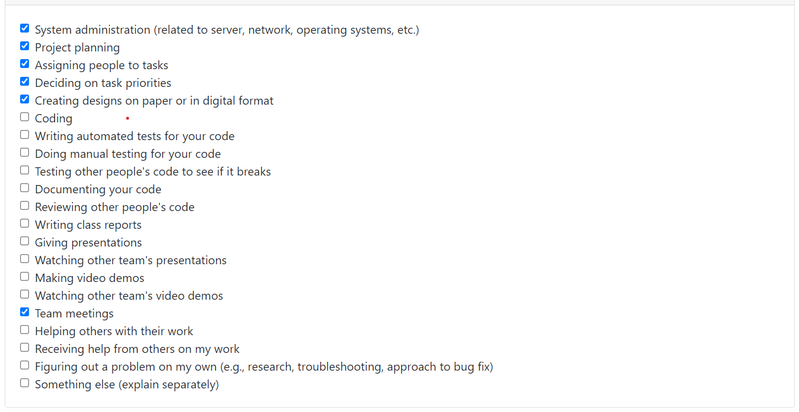
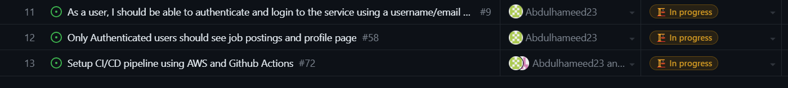
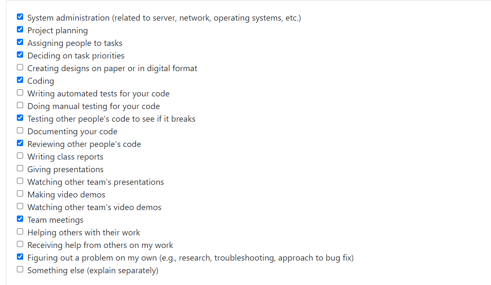

# Team 12 Weekly Log - Hameed Karim

## Week 4 Log (September 25th - October 1st)

Group member username:
@Abdulhameed23 - Hameed Karim

* Contributed to the project plan.
* Identfied interest to work on FE and BE, considering knowledge in Java and interest in working with React.
* Contributed to individual and team log template creation.
* Created Team's Kanban Board.
* Completed logs and weekly peer evaluation.

## Week 5 Log (October 2nd - October 8th)

Group member username:
@Abdulhameed23 - Hameed Karim

* Helped in brainstorming/designing App Name and Logo.
* Watched and demoed tutorial on AWS use.
* Contributed to individual and team log template creation.
* Decided on React and Java (spring) frameworks for project.
* Completed logs and weekly peer evaluation.

## Week 6 Log (October 9th - October 22nd)

Group member username:
@Abdulhameed23 - Hameed Karim

* Setup MongoDB on backend, for user login and registration.
* Started testing AWS amplify/docker for containerization.
* Setup application backend following a widget, business, transactional and DB architecture.
* Wrote code to read user details from FE and store on Database for user login and registration.
* Setting up spring framework for dependency injection on the backend.

## Week 6 Log (October 23rd - October 29th)

Group member username:
@Abdulhameed23 - Hameed Karim

* Created Rest Controllers and worked on FE connection using Spring Web MVC
* Used AWS Amplify to host the web application for the first time.
* Setting up CI/CD pipeline with AWS and Github actions (still in progress).
* Worked to implement user login and registration features for both the frontend and backend.
* Cleaned up repositories, and also removed unused code. Trying to setup dockerization for local development and testing.

I mostly worked on task 11 all week, the code functionality is good, still working on implementing testing.

