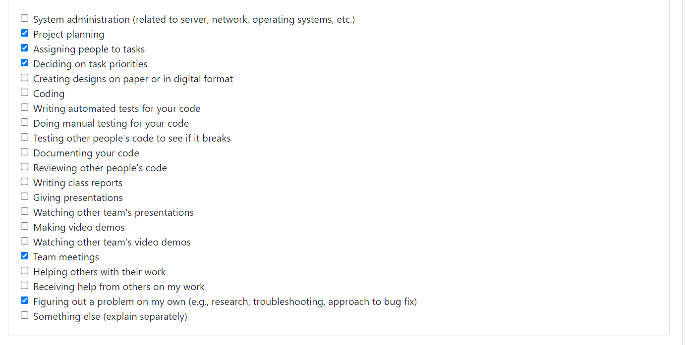

# Team 12 Weekly Log - Hameed Karim

## Week 4 Log (September 25th - October 1st)

Group member username:
@Abdulhameed23 - Hameed Karim

* Contributed to the project plan.
* Identfied interest to work on FE and BE, considering knowledge in Java and interest in working with React.
* Contributed to individual and team log template creation.
* Created Team's Kanban Board.
* Completed logs and weekly peer evaluation.

## Week 5 Log (October 2nd - October 8th)

Group member username:
@Abdulhameed23 - Hameed Karim

* Helped in brainstorming/designing App Name and Logo.
* Watched and demoed tutorial on AWS use.
* Contributed to individual and team log template creation.
* Decided on React and Java (spring) frameworks for project.
* Completed logs and weekly peer evaluation.

