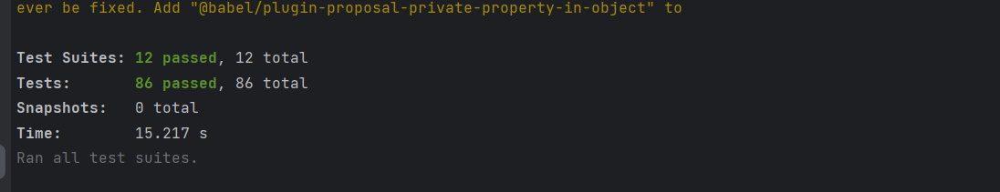
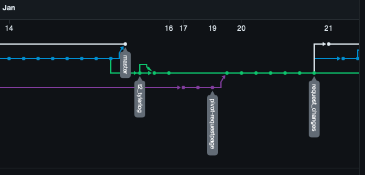
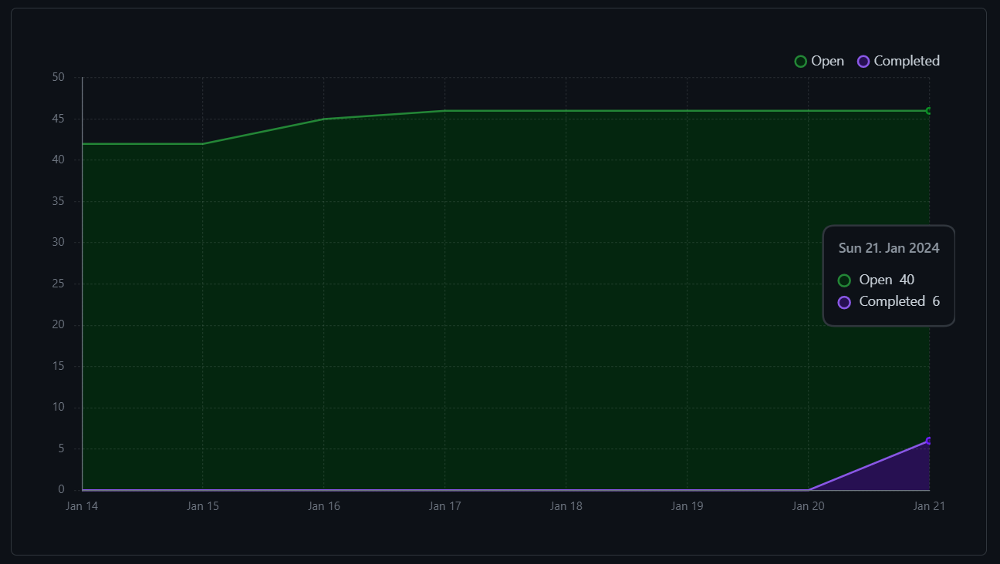
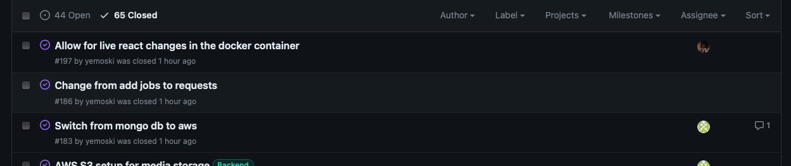
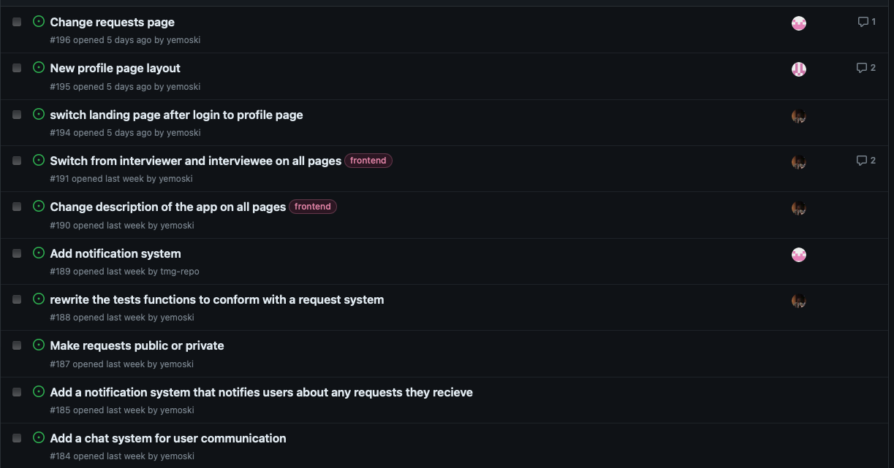
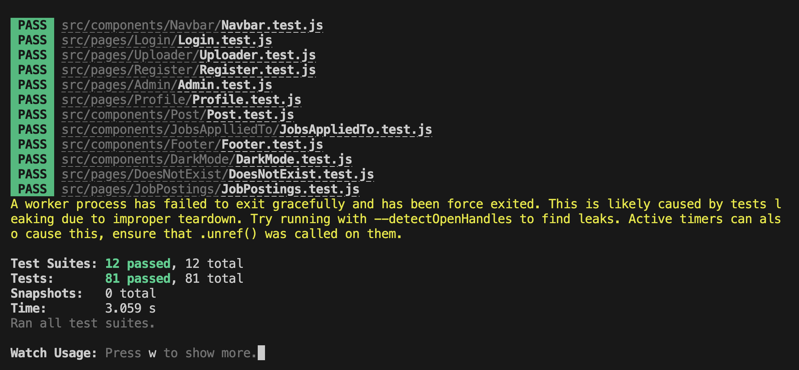
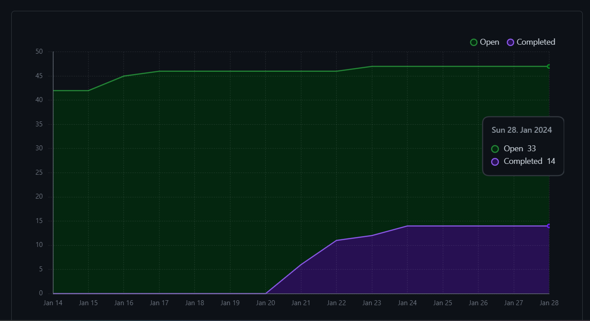
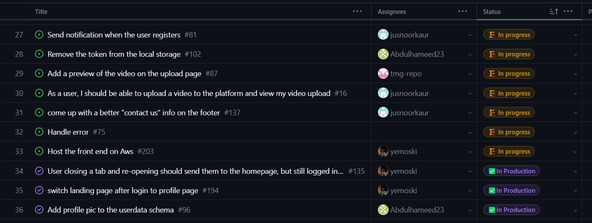
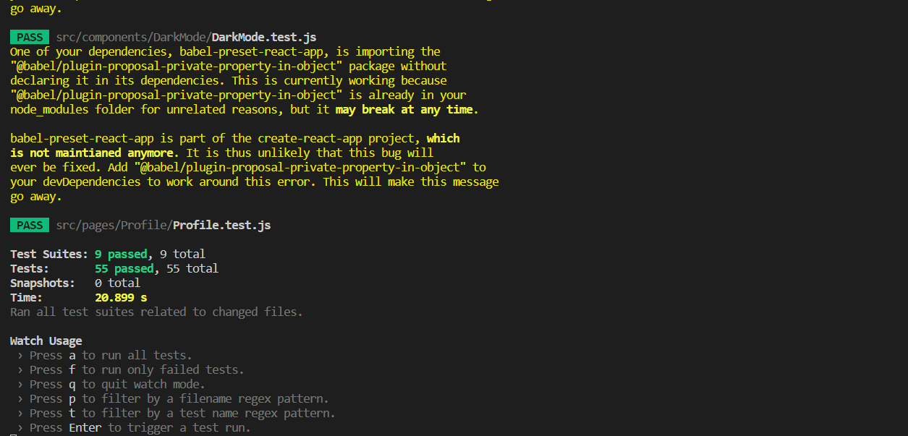
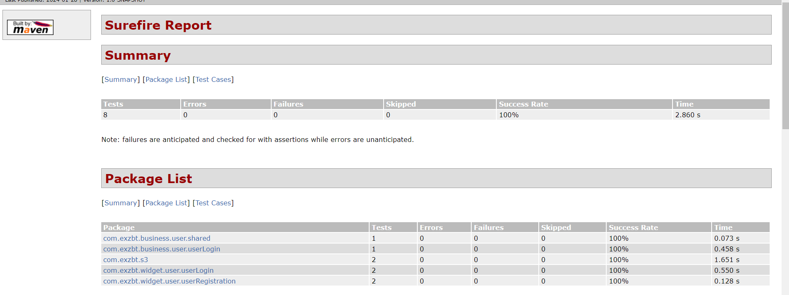

# Team 12 Week 4 Log(September 25th - October 1st)

Group member usernames:

* @yemoski - Oluwayemisi Ogungbemi

* @Abdulhameed23 - Hameed Karim

* @PhilipOkorie - Philip Okorie

* @tmg-repo - Tyler Grant

## Features for milestone

* Completed project plan (defined project features, timeline, and some user scenarios)

* Created Kanban board for new tasks/issues for project

* Defining tech stack, creating plan for learning new framework

* Assigning initial tasks to team members, according to strengths and interests

### Burnup Chart

### Kanban board - Tasks identified this week

#### *No test reports this week*

# Team 12 Week 5 Log(October 1st - October 8th)

Group member usernames:

* @yemoski - Oluwayemisi Ogungbemi

* @Abdulhameed23 - Hameed Karim

* @PhilipOkorie - Philip Okorie

* @jusnoorkaur - Jusnoor Kaur Sachdeva

* @tmg-repo - Tyler Grant

## Features for Milestone

* Created application's name and logo

* Created mockup of the web application

* Watched tutorial videos on AWS and React

* Created issues in the team's Kanban Board

### App Name and logo

### Burnup Chart

### Kanban board - Tasks identified this week

#### *No test reports this week*

# Team 12 Week 6 & 7 Log(October 9th - October 22nd)

Group member usernames:

* @yemoski - Oluwayemisi Ogungbemi

* @Abdulhameed23 - Hameed Karim

* @PhilipOkorie - Philip Okorie

* @jusnoorkaur - Jusnoor Kaur Sachdeva

* @tmg-repo - Tyler Grant

## Features for Milestone

* Created a MongoDB database backend in Java.

* Created multiple pages of the front end in React such as login, register, and a home page.

* Creating the docker setup for the project.

### Burnup Chart

### Kanban board - Tasks identified this week

#### *No test reports this week*

# Team 12 Week 8 Log(October 23rd - October 29th)

Group member usernames:

* @yemoski - Oluwayemisi Ogungbemi

* @Abdulhameed23 - Hameed Karim

* @PhilipOkorie - Philip Okorie

* @jusnoorkaur - Jusnoor Kaur Sachdeva

* @tmg-repo - Tyler Grant

## Features for Milestone

* Produced a job postings + profiles page.

* Incorporated backend into the frontend so you are able to do a beta login and register using the pages.

* AWS being used for the hosting.

### Burnup Chart

### Kanban board - Tasks identified this week

Unit Testing for BE is being done via Spring Boot and JUnit. TestNG will be used to run testing scripts as well.
For the FE, testing is being done via Jest. There was testing conducted on ensuring suitable ouputs for user error validation whilst interacting with the login and register pages.

# Team 12 Week 9 Log(October 30th - November 5th)

Group member usernames:

* @yemoski - Oluwayemisi Ogungbemi

* @Abdulhameed23 - Hameed Karim

* @PhilipOkorie - Philip Okorie

* @jusnoorkaur - Jusnoor Kaur Sachdeva

* @tmg-repo - Tyler Grant

## Features for Milestone

* Added logout features, working on password encryption.

* Working on adding profile page for users, connecting AWS s3 to BE for user picture and video storage.

* Working to improve CI/CD pipeline, hosting BE to work on AWS.

* Working on adding more tests (automated and unit tests).

### Burnup Chart

### Kanban board - Tasks identified this week

More tests are being worked on.

# Team 12 Week 10 Log(November 6th - November 12th)

Group member usernames:

* @yemoski - Oluwayemisi Ogungbemi

* @Abdulhameed23 - Hameed Karim

* @PhilipOkorie - Philip Okorie

* @jusnoorkaur - Jusnoor Kaur Sachdeva

* @tmg-repo - Tyler Grant

## Features for Milestone

* UI edits made to pages on the front end.

* Working on adding profile page for users, connecting AWS s3 to BE for user picture and video storage.

* Working to improve CI/CD pipeline, hosting BE to work on AWS.

* Added testing for front and backend processes.

* Login functionality added to reduce unneccessary API requests.

### Burnup Chart

### Kanban board - Tasks identified this week

# Team 12 Week 11-12 Log(November 12th - November 26th)

Group member usernames:

* @yemoski - Oluwayemisi Ogungbemi

* @Abdulhameed23 - Hameed Karim

* @PhilipOkorie - Philip Okorie

* @jusnoorkaur - Jusnoor Kaur Sachdeva

* @tmg-repo - Tyler Grant

## Features for Milestone

* Front end edits to fix issue with registering user and page re-direction.

* Added testing to FE and BE including pages and synchronized UI changes.

* Users can now be registered as an interviewer or interviewee.

* Darkmode feature, s3 and docker containerization.

### Burnup Chart

### Kanban board - Tasks identified this week

### Testing

# Team 12 Week 13 Log (November 27th - December 3rd)

Group member usernames:

* @yemoski - Oluwayemisi Ogungbemi

* @Abdulhameed23 - Hameed Karim

* @PhilipOkorie - Philip Okorie

* @jusnoorkaur - Jusnoor Kaur Sachdeva

* @tmg-repo - Tyler Grant

## Features for Milestone

* Dockerization of FE and BE - using containers to run the application.

* Increasing workflow of FE actions for hiring user (posting a job, viewing profile)

* GitHub Actions to run automated tests on every pull request.

* Creating production and local S3 instances, to enable media storage.

* Adding more database tables, working on continous deployment for BE.

* Researching how to use Redis in place of local storage.

### Burnup Chart

### Kanban board - Tasks identified this week

### Testing

# Team 12 Term2 Week 1 Log(January 7th - January 14th)

Group member usernames:

* @yemoski - Oluwayemisi Ogungbemi

* @Abdulhameed23 - Hameed Karim

* @PhilipOkorie - Philip Okorie

* @jusnoorkaur - Jusnoor Kaur Sachdeva

* @tmg-repo - Tyler Grant
  No tests this week

## Features for Milestone

* Beginning of term meetings: The team just got back from the holidays, with one member coming back next week
  
* AWS research and troubleshooting to incorporate more AWS resources towards project (Elastic Beanstalk, Rekognition, RDS, S3)
  
* Re-distributing tasks and defining new work process based on new semester schedules
  
* Creating and assigning new tasks based on client feedback, reworking old tasks and plan to make a more efficient plan this semester

## Burnup Chart

### Kanban board - Tasks identified this week

### Testing

# Team 12 Term2 Week 2 Log(January 15th - January 21st)

Group member usernames:

* @yemoski - Oluwayemisi Ogungbemi

* @Abdulhameed23 - Hameed Karim

* @PhilipOkorie - Philip Okorie

* @jusnoorkaur - Jusnoor Kaur Sachdeva

* @tmg-repo - Tyler Grant
  No tests this week

## Features for Milestone

* Pivoting on the front end from video uploading to a requesting system. Changes were made visually as well as site changes around user functionality.
* There were changes from using Mongo to now using Postgres.
* Backend changes made for the switchover from Mongo to Postgres as well as having a prod instance setup.
* Notification system setting up for the site to indicate video requests.

## Burnup Chart

### Kanban board - Tasks identified this week

### Testing

# Team 12 Term2 Week 3 Log(January 22nd - January 28th)

Group member usernames:

* @yemoski - Oluwayemisi Ogungbemi

* @Abdulhameed23 - Hameed Karim

* @PhilipOkorie - Philip Okorie

* @jusnoorkaur - Jusnoor Kaur Sachdeva

* @tmg-repo - Tyler Grant
  No tests this week

## Features for Milestone

* Allowing admin user to create request and generic user to view request.
* Enabling saving video functionality via file upload.
* Enabling video recording functionality via webcam.
* Improving user workflow, working on full time deployment on AWS

## Burnup Chart

### Kanban board - Tasks identified this week

### Testing

# Team 12 Term2 Week 4 Log(January 28th - Feb 4th)

Group member usernames:

* @yemoski - Oluwayemisi Ogungbemi

* @Abdulhameed23 - Hameed Karim

* @PhilipOkorie - Philip Okorie

* @jusnoorkaur - Jusnoor Kaur Sachdeva

* @tmg-repo - Tyler Grant
  No tests this week

## Features for Milestone

* Allow users to login with username and email.
* Made an empty page for users with no requests.
* Made the requests a bit more informative.
* Changed the darkmode text on the "Add a request page" to white.
* Added a delete button to the requests.
* Synced admin and generic user request flows
  

## Burnup Chart

### Kanban board - Tasks identified this week

### Testing

# Team 12 Term2 Week 4 Log(Feb 4th - Feb 11th)

Group member usernames:

* @yemoski - Oluwayemisi Ogungbemi

* @Abdulhameed23 - Hameed Karim

* @PhilipOkorie - Philip Okorie

* @jusnoorkaur - Jusnoor Kaur Sachdeva

* @tmg-repo - Tyler Grant
  No tests this week

  ## Features for Milestone
* AWS BE and FE deployment
* API creation for video blurring
* FE cosmetic changes
* Added Notifications and settings to the Profile page
* Fixed recording(Camera doesn't turn on without asking you first)
* Added favicon with title

## Burnup Chart

### Kanban board - Tasks identified this week

 

