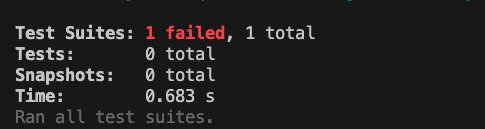

# Team 12 Week 4 Log(September 25th - October 1st)

Group member usernames:

* @yemoski - Oluwayemisi Ogungbemi

* @Abdulhameed23 - Hameed Karim

* @PhilipOkorie - Philip Okorie

* @tmg-repo - Tyler Grant

## Features for milestone

* Completed project plan (defined project features, timeline, and some user scenarios)

* Created Kanban board for new tasks/issues for project

* Defining tech stack, creating plan for learning new framework

* Assigning initial tasks to team members, according to strengths and interests

### Burnup Chart

### Kanban board - Tasks identified this week

#### *No test reports this week*

# Team 12 Week 5 Log(October 1st - October 8th)

Group member usernames:

* @yemoski - Oluwayemisi Ogungbemi

* @Abdulhameed23 - Hameed Karim

* @PhilipOkorie - Philip Okorie

* @jusnoorkaur - Jusnoor Kaur Sachdeva

* @tmg-repo - Tyler Grant

## Features for Milestone

* Created application's name and logo

* Created mockup of the web application

* Watched tutorial videos on AWS and React

* Created issues in the team's Kanban Board

### App Name and logo

### Burnup Chart

### Kanban board - Tasks identified this week

#### *No test reports this week*

# Team 12 Week 6 & 7 Log(October 9th - October 22nd)

Group member usernames:

* @yemoski - Oluwayemisi Ogungbemi

* @Abdulhameed23 - Hameed Karim

* @PhilipOkorie - Philip Okorie

* @jusnoorkaur - Jusnoor Kaur Sachdeva

* @tmg-repo - Tyler Grant

## Features for Milestone

* Created a MongoDB database backend in Java.

* Created multiple pages of the front end in React such as login, register, and a home page.

* Creating the docker setup for the project.

### Burnup Chart

### Kanban board - Tasks identified this week

#### *No test reports this week*

# Team 12 Week 8 Log(October 23rd - October 29th)

Group member usernames:

* @yemoski - Oluwayemisi Ogungbemi

* @Abdulhameed23 - Hameed Karim

* @PhilipOkorie - Philip Okorie

* @jusnoorkaur - Jusnoor Kaur Sachdeva

* @tmg-repo - Tyler Grant

## Features for Milestone

* Produced a job postings + profiles page.

* Incorporated backend into the frontend so you are able to do a beta login and register using the pages.

* AWS being used for the hosting.

### Burnup Chart

### Kanban board - Tasks identified this week

### Testing reports

The Jest testing framework was used. There was testing conducted on ensuring suitable ouputs for user error validation whilst interacting with the login and register pages.

Screenshot of some testing (testing code + file needing corrections so changes still required to have passed tests)

This is where the testing is at currently but it is being worked through on issue assigned on Kanban board.

