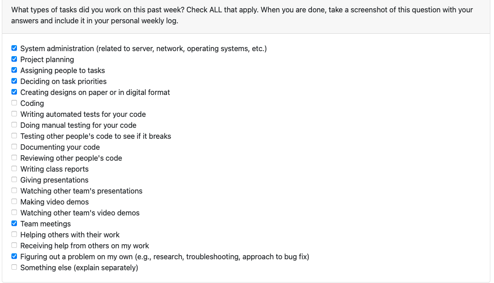
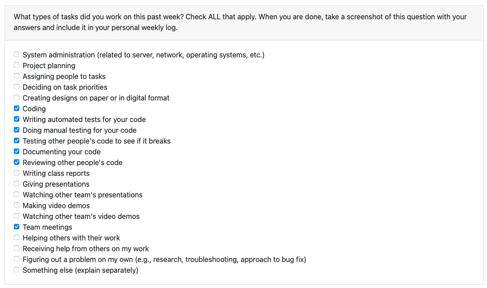
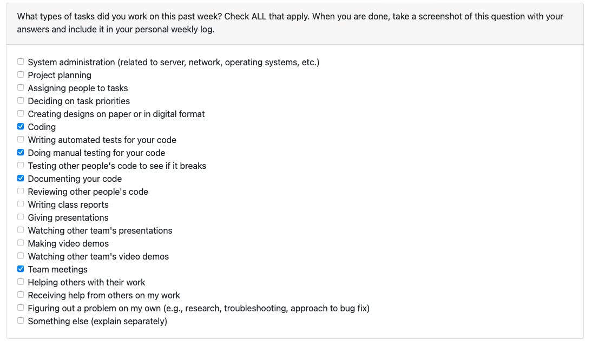
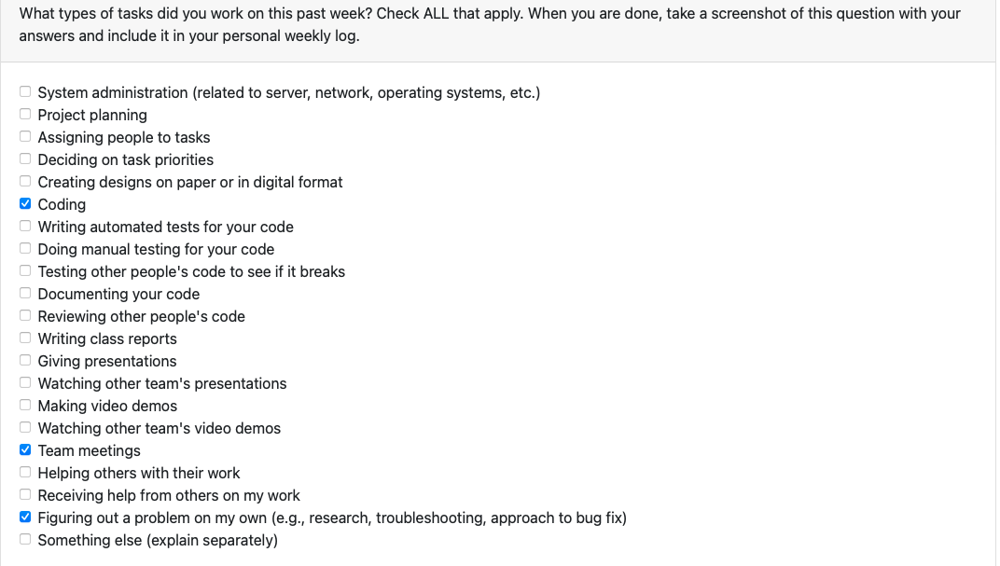
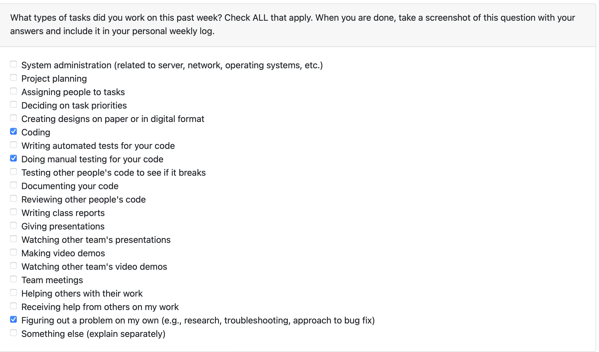
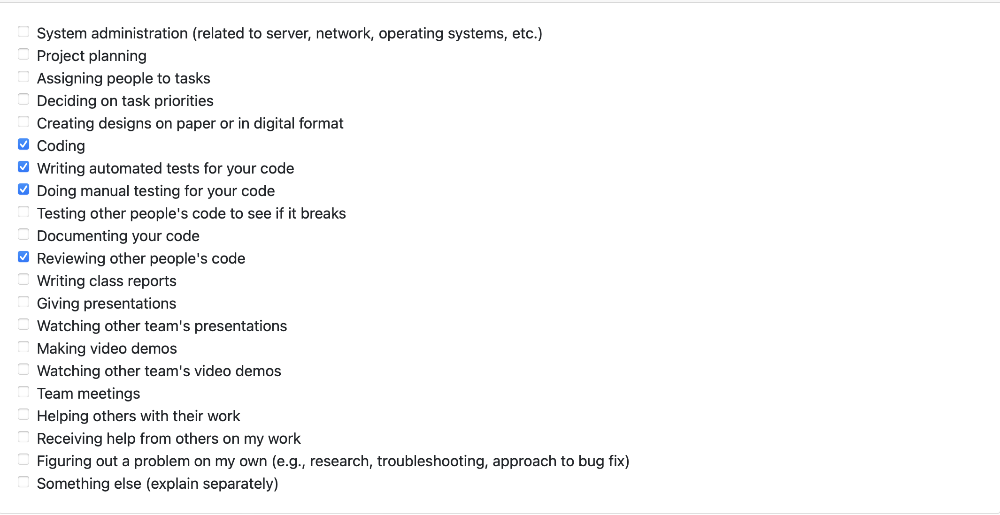
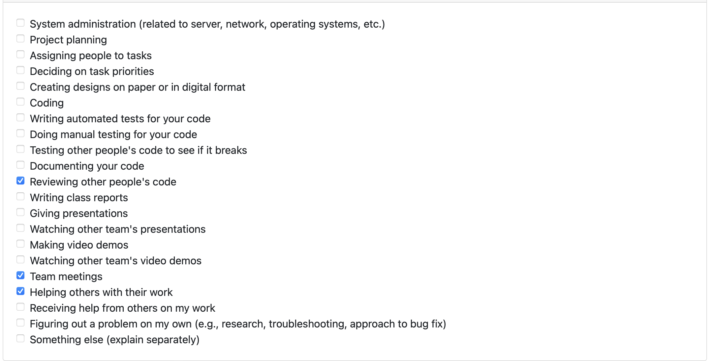

# Individual weekly log- Tyler Grant

## Week 4 Log (September 25th - October 1st)

Group member: Tyler Grant @tmg-repo

* Inputted on and helped write out the project plan document. Decided on what approach to take on our project with regards to frameworks, and features of our application with the help of other team members.
* Assigned and responded to tasks and issues created on Kanban board such as starting to learn frameworks for development.
* Wrote this log and did peer evaluation.

## Week 5 Log (October 2nd - October 8th)

* Added to and responded to issues on Kanban board.
* Started learning AWS and React watching tutorials etc. on them to gain familiarity.
* Wrote this log and did peer evaluation.

## Week 6 & 7 Log (October 9th - October 22nd)

* Continued learning React framework.
* Contributed to the creation of the front end of the project by coding pages.
* Created a team log for the week.
* Learning the AWS implementation for the project.

## Week 8 Log (October 9th - October 22nd)

* Added user input error validation to register and login pages.
* Added tests for the code that was added to see verification worked.
* Created weekly team log.

## Week 10 Log (November 6th - November 12th)

* Responded to issues on the Kanban board.
* Added user input error validation to register pages, improving the UI.
* Resized the register page responding to another issue.
* Created testing for the abovementioned issues.
* Created weekly team log.

## Week 12 Log (November 13th - November 20th)

Responded to issues on the Kanban board, namely:
* to add testing to various pages on the front end. I added manual testing.
* Synchronized UI changes across pages to ensure they look the same and have uniformity.

## Week 13 Log (November 21st - December 3rd)

* COMPLETED: Created an interviewer page, that was completed and merged. Job postings are added from here.
* Added testing for said interviewer page to cover unit testing. 
* Edited navbar to render based off of user type (hiring or candidate).
* Made video for design document for team.
* IN PROGRESS: password encryption and decryption was worked on for more secure application, testing still needed in order to merge change.

## Week 13 Log (November 21st - December 3rd)

* COMPLETED: Created an interviewer page, that was completed and merged. Job postings are added from here.
* Added testing for said interviewer page to cover unit testing. 
* Edited navbar to render based off of user type (hiring or candidate).
* Made video for design document for team.
* IN PROGRESS: password encryption and decryption was worked on for more secure application, testing still needed in order to merge change.

## T2 Week 1 Log (January 8th-January 14th)

* COMPLETED: Project management and redesigning the layout and intention of the appplication with regards to feedback. Modifying code to change and reflect these changes before moving forward.
* IN PROGRESS: notification systen integreating alerts for users and ticketed on the Pm software.

## T2 Week 2 Log (January 15th-January 21st)

* COMPLETED: pivoting to a requests system on the front end as opposed to the video upload submissions, and closed the issue assigned to me.
* creating a notification system for the frontend side.
* changing the copy and aesthetics to fit the new system.

## T2 Week 2 Log (January 22nd-January 28th)

* COMPLETED: finishing the ability to create a video submission.
* added testing for multiple files changes, so added three new testing suites.

## T2 Week 4 Log (January29th-February 4th)

* COMPLETED: the UI was bad for requests so I conformed with rest of website stylings and applied it to this page so that it looked better. Changed buttons, screen positions. Did the coding of new request pages with issues logged to be able to edit the video better in progress.

## T2 Week 5 Log (February 5th-February 11th)

* COMPLETED: added favicon to website.

* IN PROGRESS: testing and added functionality for recording for privacy, improved experience etc. Not able to merge this week due to failing tests, plan to include it as part of next weeks log.

## T2 Week 6 Log (February 12th-February 18th)

* COMPLETED: logout confirmation check.

* COMPLETED: login error check(valid entry but wrong details)

* COMPLETED: updated footer info with email link (small change that might be revised further on for "branding", good placeholder for now)

* IN PROGRESS: still carrying over record changes as mentioned, decided to work on other stuff to feel like I was moving forward, and giving myself reading week to try make changes that look a good finished product.

## T2 Week 7&8 Log (February 19th - March 3rd)

* Coded over reading week. No coding completed this week, just reviewing of code.

* Reading week code was on a later branch that needs to now be added to newer code with newer themes and integrated together.

## T2 Week 9 Log (March 3rd - March 10th)

* COMPLETED: Implemented and added testing for the recording changes spoken about and done in some weeks previous too.

## T2 Week 10 Log (March 11th - March 17th)

* IN PROCESS: started work on some issues in backlog, no code to push as of yet. Will plan on getting bonus marks next week from the carry-over.

## T2 Week 11 + 12 Log (March 18th - March 31st)

